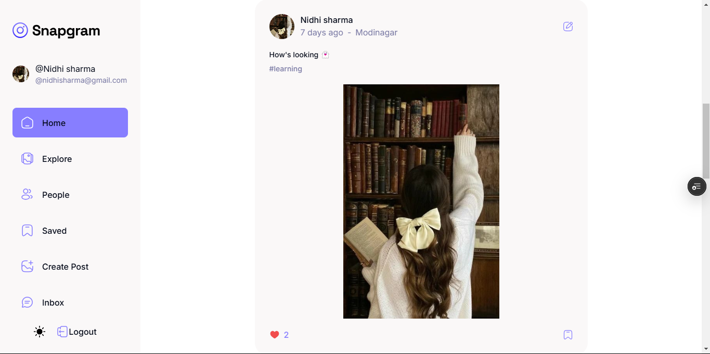
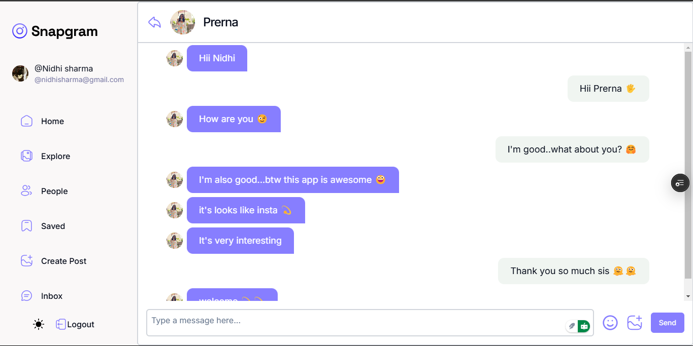

# 🪄 Snapgram 
  
> A dynamic and interactive social media platform built with the power of the **MERN Stack** and **Firebase** for image storage.

---

## 🚀 Features

### 🌟 Core Functionalities
- ✍️ **Create, Update, Delete Posts:** Share your thoughts and visuals effortlessly.
- 💾 **Save Posts:** Bookmark your favorite posts for easy access.
- 👥 **Followers & Followings:** Stay connected with your community.
- 💬 **Real-Time Chat:** Engage in seamless conversations with friends powered by **Pusher**.
- 🌟 **Theme:** You can switch between dark and light theme

### ⚙️ Tech Stack
- 💡 **Frontend:** React.js with modern hooks and component-based architecture.
- 🛠️ **Backend:** Node.js with Express.js.
- 📂 **Database:** MongoDB for scalable data storage.
- 📷 **Image Handling:** Firebase for secure and efficient image hosting.
- 🔔 **Real-Time Communication:** Pusher for instant messaging.

---

## 🛠️ Installation & Setup

1. **Clone the repository:**
   ```bash
   git clone https://github.com/NidhiSharma63/snapgram.git
   cd snapgram
   ```

2. **Install dependencies:**
   ```bash
   npm install
   cd client && npm install
   cd server && npm install
   ```

3. **Environment Variables:** Create a `.env` file in `client` and add the following:
   ```env
    VITE_BASE_URL = YOUR_LOCAL_HOST
    VITE_APP_FIREBASE_API_KEY = FIRE_BASE_KEY
    VITE_APP_AUTH_DOMAIN = FIRE_BASE_AUTH_DOMAIN
    VITE_APP_PROJECT_ID = FIRE_BASE_PROJECT_ID
    VITE_APP_STORAGE_BUCKET = FIRE_BASE_BUCKET_ID
    VITE_APP_APP_ID = FIRE_BASE_APP_ID
    VITE_APP_PUSHER_APP_ID = PUSHER_APP_ID
    VITE_APP_PUSHER_CLUSTER = CLUSTER
   ```
4. **Environment Variables:** Create a `.env` file in `server` and add the following:
   ```env
    MONGO_URI = MONGO_DB_URI
    PORT = 5000
    SECRET_KEY = SECRET_KEY_FOR_JWT
    CLIENT_URL = http://localhost:3000
    PUSHER_APP_ID = PUSHER_APP_ID
    PUSHER_KEY = PUSHER_KEY
    PUSHER_SECRET = PUSHER_SECRET
    PUSHER_CLUSTER = PUSHER_CLUSTER
   ```

5. **Run the application:**
   ```bash
   # Start backend
    npm run dev

   # Start frontend
   cd client && npm run dev
   ```

---

## 📸 Screenshots

| 🏠 Home Page | 💬 Chat Feature |
| --------- | ------------ |
|  |  |

---

## 👍 Contributing
Contributions, issues, and feature requests are welcome! Feel free to fork the repository and submit a pull request.

---

## 🌐 Connect
[](https://github.com/NidhiSharma63/snapgram.git)  
Feel free to connect for feedback or questions.

---

Made with ❤️ by Nidhi sharma

